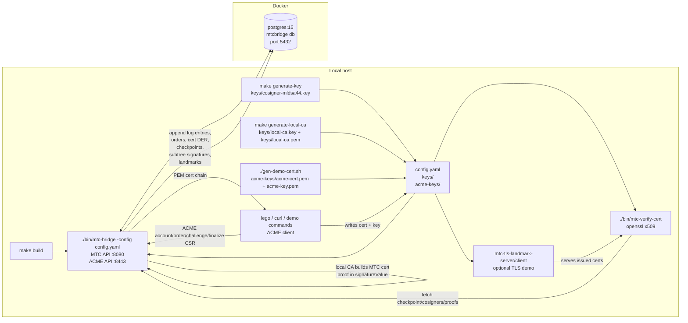
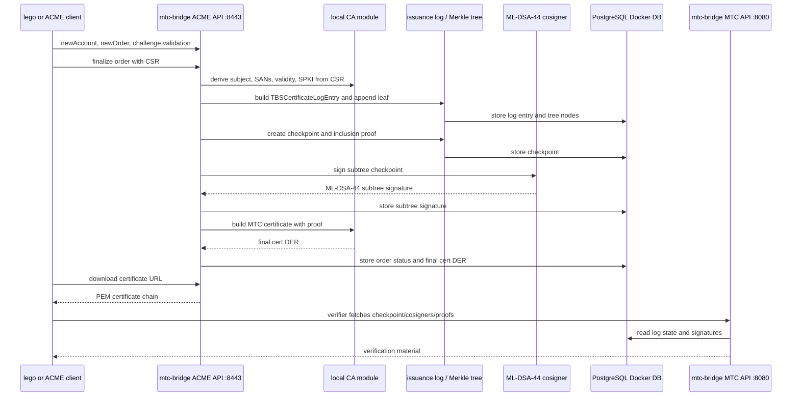

# Local CA Certificate Operations Demo

This is a copy-paste runbook for the local CA / ACME / MTC demo. It covers:

- requesting a standalone MTC certificate with `lego`
- requesting a landmark-relative signatureless certificate
- verifying both certificates
- checking the database entries
- running a TLS client/server demo

The default local configuration uses:

- MTC HTTP API: `http://localhost:8080`
- ACME API: `https://localhost:8443`
- local CA: `local_ca.enabled: true`
- MTC certificates: `local_ca.mtc_mode: true`
- standalone profile: `local_ca.mtc_profile: standalone`
- cosigner signature algorithm: `mldsa44`
- landmark allocation: `landmarks.enabled: true`

## Local CA Component Map

The local demo uses Docker only for the PostgreSQL state database. The
`mtc-bridge` binary runs locally and serves both the MTC HTTP API and the ACME
HTTPS API from the same process.



Certificate issuance in the local CA flow is:



## Build

Run from the repository root:

```bash
cd ~/digi/ca-extension-mtc-playground
```

Build all binaries:

```bash
make build
```

Generate local keys if this is a fresh checkout:

```bash
make generate-key
make generate-local-ca
```

This creates:

- `keys/cosigner-mldsa44.key`: ML-DSA-44 cosigner key for MTC subtree signatures
- `keys/local-ca.key`: local CA private key
- `keys/local-ca.pem`: local CA certificate

Generate ACME HTTPS keys if needed:

```bash
./gen-demo-cert.sh
```

Start PostgreSQL and the bridge/ACME service:

```bash
docker compose up -d postgres
./bin/mtc-bridge -config config.yaml
```

Or run the service with Docker Compose:

```bash
docker compose up -d --build mtc-bridge acme-server
```

Health checks:

```bash
curl -s http://localhost:8080/healthz
curl -s http://localhost:8080/checkpoint
curl -s http://localhost:8080/cosigners
```

The cosigner output should include:

```json
"algorithm":"mldsa44"
```

## Usage: Request, Verify, Demo

### Request Standalone Certificate With Lego

Clean previous output:

```bash
rm -f testcerts/certificates/root.yven.ch.*
```

Request a certificate:

```bash
LEGO_CA_CERTIFICATES=acme-keys/acme-cert.pem \
lego \
  --server https://localhost:8443/acme/directory \
  --email mtc@yven.ch \
  --accept-tos \
  --domains root.yven.ch \
  --path ./testcerts \
  --http \
  --http.port :5002 \
  run
```

Expected output includes:

```text
Server responded with a certificate.
```

Generated files:

```bash
ls -la testcerts/certificates
```

Inspect the standalone certificate:

```bash
openssl x509 -in testcerts/certificates/root.yven.ch.crt -noout -text
```

Expected MTC markers:

```text
Signature Algorithm: 1.3.6.1.4.1.44363.47.0
Issuer: 1.3.6.1.4.1.44363.47.1 = http://localhost:8080
```

Note: with `lego`, the certificate subject public key is usually still P-256 EC,
because lego generated the CSR key. The MTC cosigner signature is ML-DSA-44.

### Verify Standalone Certificate

```bash
./bin/mtc-verify-cert \
  -cert testcerts/certificates/root.yven.ch.crt \
  -bridge-url http://localhost:8080
```

Expected:

```text
Mode: signed
[PASS] Inclusion proof valid
[PASS] 1 trusted cosigner signature(s) verified
```

For ML-DSA-44, the signature length shown by the verifier should be `2420 bytes`.

### Check Database Entries

Latest ACME orders:

```bash
docker compose exec postgres psql -U mtcbridge -d mtcbridge -c \
"select id,status,identifiers,certificate_url,octet_length(final_cert_der) as cert_bytes,cert_serial,created_at,updated_at from acme_orders order by created_at desc limit 10;"
```

Latest log entries:

```bash
docker compose exec postgres psql -U mtcbridge -d mtcbridge -c \
"select idx,entry_type,serial_hex,ca_cert_id,created_at from log_entries order by idx desc limit 10;"
```

Latest standalone subtree signatures:

```bash
docker compose exec postgres psql -U mtcbridge -d mtcbridge -c \
"select id,start_idx,end_idx,cosigner_id,algorithm,octet_length(signature) as sig_bytes,created_at from subtree_signatures order by id desc limit 10;"
```

Expected for ML-DSA-44:

```text
algorithm = 1
sig_bytes = 2420
```

### Revoke Issued Certificate

Live local revocation writes are protected by a bearer token. Set it before
starting the bridge:

```bash
export MTC_REVOCATION_ADMIN_TOKEN=dev-revoke-token
./bin/mtc-bridge -config config.yaml
```

For MTC-spec certificates, the certificate serial is the Merkle log index.
Get it from the verifier output:

```bash
./bin/mtc-verify-cert \
  -cert testcerts/certificates/root.yven.ch.crt \
  -bridge-url http://localhost:8080
```

Expected line:

```text
Serial/Index: <index>
```

Revoke that index without stopping the bridge:

```bash
curl -s -X POST "http://localhost:8080/revocation?id=<index>" \
  -H "Authorization: Bearer ${MTC_REVOCATION_ADMIN_TOKEN}" \
  | python3 -m json.tool
```

You can also send JSON:

```bash
curl -s -X POST "http://localhost:8080/revocation" \
  -H "Authorization: Bearer ${MTC_REVOCATION_ADMIN_TOKEN}" \
  -H "Content-Type: application/json" \
  -d '{"index":<index>,"reason":0}' \
  | python3 -m json.tool
```

Check the public revocation view:

```bash
curl -s "http://localhost:8080/revocation?format=json" | python3 -m json.tool
```

The binary bitmap remains available for clients:

```bash
curl -s -o /tmp/revocation.bin "http://localhost:8080/revocation"
```

After revocation, verification with `-bridge-url` should fail:

```bash
./bin/mtc-verify-cert \
  -cert testcerts/certificates/root.yven.ch.crt \
  -bridge-url http://localhost:8080
```

Expected output includes:

```text
[FAIL] Certificate revoked at log index <index>
```

### Request Landmark Certificate

Wait for automatic landmark allocation. The demo config uses:

```yaml
landmarks:
  enabled: true
  interval: 1m
```

Wait and inspect landmarks:

```bash
sleep 70
curl -s http://localhost:8080/landmarks.txt
curl -s http://localhost:8080/trusted-subtrees
```

Get the latest valid ACME order ID:

```bash
ORDER_ID=$(docker compose exec -T postgres psql -U mtcbridge -d mtcbridge -Atc \
"select id from acme_orders where status='valid' order by created_at desc limit 1;")
echo "$ORDER_ID"
```

Download the landmark-relative signatureless certificate:

```bash
curl --cacert acme-keys/acme-cert.pem \
  -D /tmp/landmark.headers \
  -o testcerts/certificates/root.yven.ch.landmark.crt \
  "https://localhost:8443/acme/certificate/${ORDER_ID}/landmark"

cat /tmp/landmark.headers
```

Expected:

```text
HTTP/2 200
x-mtc-landmark-number: <number>
```

Inspect it:

```bash
openssl x509 -in testcerts/certificates/root.yven.ch.landmark.crt -noout -text
```

The landmark certificate should have:

- same subject, public key, validity, and serial as the standalone certificate
- `Signatures: 0` when parsed by `mtc-verify-cert`
- a much smaller `Signature Value`

### Verify Landmark Signatureless Certificate

```bash
./bin/mtc-verify-cert \
  -cert testcerts/certificates/root.yven.ch.landmark.crt \
  -bridge-url http://localhost:8080
```

Expected:

```text
Mode: signatureless
[PASS] Inclusion proof valid
[INFO] Loaded ... trusted landmark subtree(s) from bridge
```

If the landmark subtree is exactly one leaf, the certificate may show:

```text
Subtree:        [N, N+1)
Inclusion proof: 0 hashes
Signatures:     0
```

That is correct.

### TLS Client / Server Demo

The TLS server can serve MTC-spec certificates directly. Start it with the
standalone MTC certificate and private key generated by lego:

```bash
./bin/mtc-tls-server \
  -cert testcerts/certificates/root.yven.ch.crt \
  -key testcerts/certificates/root.yven.ch.key \
  -bridge-url http://localhost:8080 \
  -addr :4443
```

In another terminal:

```bash
./bin/mtc-tls-verify \
  -url https://localhost:4443 \
  -bridge-url http://localhost:8080 \
  -insecure \
  -verbose
```

You can also serve the landmark-relative signatureless certificate:

```bash
./bin/mtc-tls-server \
  -cert testcerts/certificates/root.yven.ch.landmark.crt \
  -key testcerts/certificates/root.yven.ch.key \
  -bridge-url http://localhost:8080 \
  -addr :4443
```

For full proof verification of the exact cert file, use `mtc-verify-cert`:

```bash
./bin/mtc-verify-cert \
  -cert testcerts/certificates/root.yven.ch.landmark.crt \
  -bridge-url http://localhost:8080
```

### Landmark-Aware TLS Selection Demo

The landmark-aware TLS demo keeps the old TLS commands available and adds a
server/client pair that can negotiate which certificate to send. The client
loads trusted landmark subtrees from `mtc-bridge`, advertises them with ALPN,
and the server sends the landmark certificate only when the client supports the
exact landmark range. Otherwise it falls back to the standalone signed cert.
The client refreshes landmark trust every 30 minutes by default.

Start the landmark-aware server immediately after normal certificate issuance.
At this point the landmark certificate may not exist yet, and that is fine: the
server will serve the standalone signed certificate and poll the landmark file
path until it appears.

```bash
pkill -f mtc-tls-landmark-server || true

./bin/mtc-tls-landmark-server \
  -cert testcerts/certificates/root.yven.ch.crt \
  -landmark-cert testcerts/certificates/root.yven.ch.landmark.crt \
  -key testcerts/certificates/root.yven.ch.key \
  -bridge-url http://localhost:8080 \
  -addr :4443 \
  -landmark-refresh 30s
```

In another terminal, run the landmark-aware client before requesting the
landmark certificate. It should receive and verify the standalone signed
certificate:

```bash
./bin/mtc-tls-landmark-client \
  -url https://localhost:4443 \
  -bridge-url http://localhost:8080 \
  -insecure \
  -verbose
```

Expected:

```text
Signatures:   1
Mode:         signed
Verification mode: standalone signed
```

After a landmark is allocated, request the landmark certificate into the path
the server is polling:

```bash
ORDER_ID=$(docker compose exec -T postgres psql -U mtcbridge -d mtcbridge -Atc \
"select id from acme_orders where status='valid' order by created_at desc limit 1;")

curl --cacert acme-keys/acme-cert.pem \
  -o testcerts/certificates/root.yven.ch.landmark.crt \
  "https://localhost:8443/acme/certificate/${ORDER_ID}/landmark"
```

Wait up to `-landmark-refresh`, then run the client again. With fresh landmark
trust, it should receive and verify the signatureless landmark certificate:

```bash
./bin/mtc-tls-landmark-client \
  -url https://localhost:4443 \
  -bridge-url http://localhost:8080 \
  -insecure \
  -verbose
```

Expected:

```text
Signatures:   0
Mode:         signatureless
Verification mode: signatureless landmark
```

Demonstrate fallback by disabling landmark advertisement. The server should
send the standalone signed certificate:

```bash
./bin/mtc-tls-landmark-client \
  -url https://localhost:4443 \
  -bridge-url http://localhost:8080 \
  -advertise-landmarks=false \
  -insecure \
  -verbose
```

The client can also cache trust material for offline fallback:

```bash
./bin/mtc-tls-landmark-client \
  -url https://localhost:4443 \
  -bridge-url http://localhost:8080 \
  -cache /tmp/mtc-landmark-trust.json \
  -insecure
```

### Optional: Demo Certificate With ML-DSA-44 Subject Public Key

Lego currently generates a P-256 CSR by default. To demonstrate an MTC
certificate whose subject public key is ML-DSA-44, use the repo demo command:

```bash
./bin/demo-embedded-cert \
  -mtc-mode \
  -domain pq.yven.ch \
  -output /tmp/pq-mtc.pem
```

Inspect the public key algorithm:

```bash
openssl x509 -in /tmp/pq-mtc.pem -noout -text | sed -n '/Subject Public Key Info:/,/X509v3 extensions:/p'
```

Verify the MTC proof:

```bash
./bin/mtc-verify-cert -cert /tmp/pq-mtc.pem
```

## Troubleshooting

If lego fails with `authorization[get]: empty URL`, rebuild and restart the
bridge. The ACME challenge response must include `Link: rel="up"`.

If lego tries to fetch `/landmark` and fails, rebuild and restart the bridge.
The normal certificate response should not advertise the landmark certificate
as an automatic ACME alternate during the initial lego request.

If `LEGO_CA_CERTIFICATES=acme-keys/acme-cert.pem` fails with `no such file`,
make sure you are running commands from the repository root.

If `jq` is not installed, use raw `curl` output or:

```bash
python3 -m json.tool
```

Example:

```bash
curl -s http://localhost:8080/trusted-subtrees | python3 -m json.tool
```
